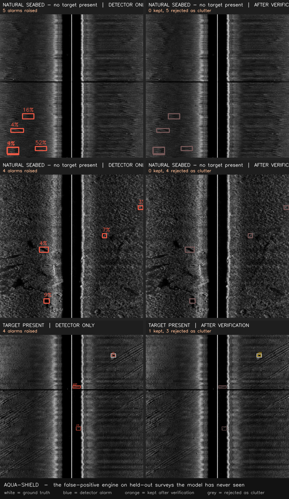
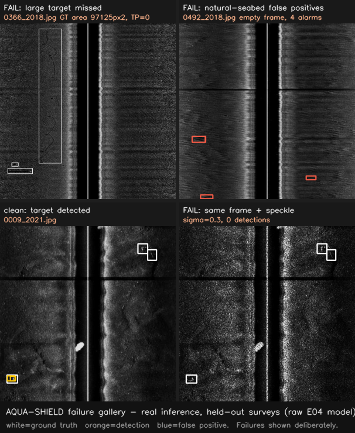

# 🛰️ AQUA-SHIELD

**Acoustic Intelligence for Underwater Anomaly, Debris & Marine-Hazard Localization**
**Detection → Verification → Localization → Action**

SIH 2026 · PS **26057** · MoES / NIOT · Side-Scan Sonar · runs offline on a laptop.

The hard part of PS 26057 is **not detection** — in our data **74% of sonar frames
are empty seabed**, so a system that fires on a fraction of those is worse than
useless. **Precision, not recall, is the binding constraint.** AQUA-SHIELD detects
candidates, then *verifies them against physical evidence*, calibrates confidence,
merges repeat sightings, geolocates *only when metadata allows*, prioritises, and
exports an actionable report.

> **Design rule that shapes everything:** never fabricate a value. No coordinate
> without navigation metadata, no calibrated probability without a fitted
> calibrator, no size without a ground sample distance — each is `null` + a reason.

---

## Architecture

```
RAW SSS ─▶ QC ─▶ [preprocessing OFF by default*] ─▶ TILING ─▶ YOLO11n (raw-trained)
                                                                   │
   REPORT ◀─ PRIORITY ◀─ GEOLOCATION (or refuse) ◀─ DEDUP ◀────────┤
                                                                   │
                                   CALIBRATION ◀─ LEARNED FP FILTER ┘
```
\* preprocessing measured to *hurt* SSS — see "What we tried".

| Stage | What it does |
|---|---|
| **QC** | dynamic range, speckle, dropout rows, water-column detection (measured, never guessed) |
| **Tiling** | overlapping tiles at native res; seam duplicates merged by IoU **or** intersection-over-smaller |
| **Detector** | YOLO11n, 2.58 M params, **6.3 GFLOPs**, backend-swappable (Ultralytics / torchvision) |
| **FP filter** | L2-logistic over **10 physical features** + raw score, fitted on a held-out survey, per-detection attribution |
| **Calibration** | Platt scaling; stamps `calibrated:false` when unfit — never passes a raw score off as a probability |
| **Dedup** | geographic or ping-sequence association → unique hazards; √N uncertainty reduction |
| **Geolocation** | GeoTIFF affine · per-ping nav · **or refuse** — every fix carries a metres error budget |
| **Priority** | separate from confidence; interpretable, tunable weights |

Full detail: [`docs/ARCHITECTURE.md`](docs/ARCHITECTURE.md).

---

## Data

Only **MILCO/NOMBO** (SSS, CC BY 4.0, DOI `10.6084/m9.figshare.24574879`) is behind
any reported number. Splits are by **acquisition year** (leakage-free), never random.

| Split | Surveys | Frames | Objects |
|---|---|---|---|
| train | 2015 + 2010 | 465 | 447 |
| val (fits FP filter + calibration) | 2017 | 93 | 30 |
| **test (all metrics)** | 2018 + 2021 | 612 | 191 (473 empty frames) |

**Honest gaps:** we have **never detected a ghost net** (the ghost-gear dataset is
gate-`auto` on HF — needs one human "Agree and access" click, ingestion pipeline
already built and tested); geolocation accuracy is **never validated** (no nav data);
the thesis's headline preprocessing gain is on **FLS, not SSS**. Every other dataset
(UATD·FLS, Marine-Debris·FLS, AI4Shipwrecks·wrecks, KLSG, TiHAN/IITH·Indian-but-gated)
is assigned a non-training role — see [`research/dataset_role_matrix.md`](research/dataset_role_matrix.md),
[`research/DATA_CARD.md`](research/DATA_CARD.md).

---

## Results (measured, held-out surveys — Apple M5)

| | Value |
|---|---|
| Detector mAP50 (cross-survey) | **0.116** |
| Precision: detector → **+ learned FP filter** | 0.247 → **0.322** |
| Falsely-alarmed empty frames: detector → **+ filter** | 37/473 → **25/473** (keeps 19 of 21 TPs) |
| MPS vs CPU inference | **21 ms** vs 82 ms · 37 fps · 640 MB peak |
| ONNX export | **10.6 MB · 8.5 ms** (CoreML EP) |

Accuracy is modest and honestly so (447 training objects, ~24 px targets, 11-year
survey gap) — but **not inflated by a random split**. Full tables + reproduction:
[`docs/BENCHMARKS.md`](docs/BENCHMARKS.md) · `scripts/run_full_evaluation.sh`.



---

## What we tried (and what the evidence said)

| Experiment | Result | Kept? |
|---|---|---|
| YOLO11n raw (E04) | mAP50 0.116 | **primary** |
| Our sonar preprocessing, matched (E06) | 0.032 — **hurts SSS** | rejected |
| **Thesis 5-step preprocessing, matched (E07)** | 0.043 — FLS gain **doesn't transfer** to SSS | rejected |
| **Speckle augmentation (E08)** | speckle recall retention **0% → ~41%**; clean-mAP trade 0.116→0.076 | mechanism proven, not yet promoted |
| **Learned FP filter** | precision +30%, false-alarm frames −32%, beats hand-rules | **kept** |
| **Anomaly autoencoder** | AUROC **≈ 0.5 (chance)** | **rejected with evidence** |
| Dual-tier UI (SeaClear/SeeByte) | operator + executive views | **kept** |

**Cross-cutting findings:** preprocessing is measured, not assumed (12× collapse if
mismatched); the smallest targets are detected best while **every large target is
missed** (recall 0.000 >2500 px²); an inspectable filter *diagnosed a bug in our own
pipeline*; speckle-aug training solves a robustness gap that a **Nov-2025 published
paper still lists as future work**. Six external references cross-checked (thesis,
TR-YOLOv5s, MSF-DETR, BHP-UNet, LEF-RT-DETR + 4 production systems) — none beat this
architecture's shape; all confirm the edge-cost discipline.

**[`docs/FULL_ARCHITECTURE_ANALYSIS.md`](docs/FULL_ARCHITECTURE_ANALYSIS.md)** is the
complete component-by-component record — every candidate tested, every measurement,
why each was kept/rejected/deferred, and the full comparison against all six papers
and four production systems. `research/FINAL_ARCHITECTURE.md` is the shorter
winning-approach argument; `thesis_discrepancies.md`, `external_architectures.md`,
`ARCHITECTURE_DECISION.md` hold the deeper per-topic notes.



---

## What's to be done (next)

1. **Ghost-gear training — one click away.** `scripts/prepare_crab_pot.py` is
   built and tested (6,674 real SSS images, recording-level leakage-free split)
   but the HF dataset is gate-`auto`: a human must open the dataset page and
   click *Agree and access repository* once — no API/token can do this step.
2. Longer, tuned **speckle-aug** run to recover clean mAP → promote to primary.
3. Fix **large-target recall** (balance scale-augmentation + cross-survey sizes).
4. Replace the failed AE with **embedding-novelty** anomaly (PaDiM / PatchCore).
5. Train the **torchvision backend** → licence-clean (non-AGPL) path.
6. **TiHAN/IITH Indian SSS** access — same one-human-step pattern as #1.
7. Evaluate **cross-track downsampling** (TR-YOLOv5s) as a matched retrain.

---

## Current UI

Streamlit dashboard, **dual-tier** (SeaClear / SeeByte pattern):

- **🎛️ Operator (technical):** 6 tabs — detections overlay, map with uncertainty
  circles, hazard register + evidence, QC, export, full provenance.
- **📋 Executive summary:** clean decision view — headline metrics, map, top-10
  hazards, one-click JSON/CSV/GeoJSON, calibration-honesty line.

Four SIH demo scenarios (all held-out): clear targets · hard targets · natural
seabed (false-positive challenge) · georeferenced (synthetic nav, labelled as such).
Also a **FastAPI** service (9 endpoints, OpenAPI) and **SQLite** store.

---

## Run it

```bash
./setup.sh                                # venv + deps (uses uv)
python scripts/download_datasets.py       # MILCO/NOMBO, CC BY 4.0, ~218 MB
python scripts/prepare_milco_nombo.py     # leakage-free survey splits
python scripts/train.py --exp-id E01 --epochs 150
python scripts/fit_verification.py --weights runs/detect/**/weights/best.pt
./run_demo.sh                             # dashboard at localhost:8501
```
Fully offline: `export AQS_OFFLINE_MAP=1`. No cloud API calls in any code path.
Apple Silicon first (MPS → CPU fallback, no CUDA assumed). `python -m pytest tests/` → **115 passing**.

---

## Honesty, licence, attribution

Read [`docs/LIMITATIONS.md`](docs/LIMITATIONS.md) first (16 items). 56 hard judge
Q&As in [`docs/JUDGE_QUESTIONS.md`](docs/JUDGE_QUESTIONS.md).

Code **MIT**; the default Ultralytics backend is **AGPL-3.0**, so the combined work
is AGPL — see [`LEGAL_AND_LICENSES.md`](LEGAL_AND_LICENSES.md).

Imagery: Pessanha Santos & Moura (2024), *Data in Brief* 53:110132, figshare
`10.6084/m9.figshare.24574879`, **CC BY 4.0** (re-split by year; pixels/labels
unmodified).
